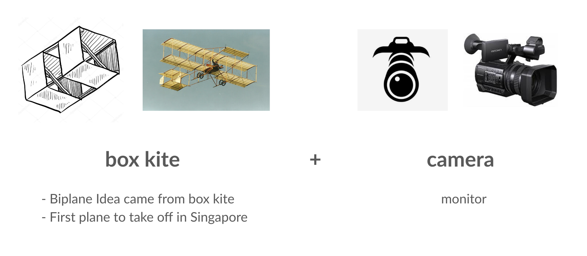

# FAQs

## Does boxkite support anomaly / outlier detection?

Prometheus has supported outlier detection in time series data since 2015. Once you've setup KL divergence and K-S test metrics, outlier detection can be configured on top using alerting rules. For a detailed example, refer to this tutorial: https://prometheus.io/blog/2015/06/18/practical-anomaly-detection/.

## Does boxkite support adversarial detection?

Adversarial detection concerns with identifying single OOD (Out Of Distribution) samples rather than comparing whole distributions. The algorithms are also highly model specific. For these reasons, we do not have plans to support them in boxkite at the moment. As an alternative, you may look into Seldon for such capabilities https://github.com/SeldonIO/alibi-detect#adversarial-detection.

## Does boxkite support concept drifts for text / NLP models?

Not yet. This is still an active research area that we are keeping an eye out for.

## Does boxkite support tensorflow / pytorch?

Yes, our instrumentation library is framework agnostic. It expects input data to be a `list` or `np.array` regardless of how the model is trained.

## Where did the name "boxkite" come from?

The [Bristol Boxkite](https://en.wikipedia.org/wiki/Bristol_Boxkite) is an early biplane, it was the first plane to take off in Singapore.

This celebrates the Bristol/Singapore connection between the founders of this project: [Luke Marsden](https://www.linkedin.com/in/luke-marsden-71b3789/) in Bristol, England and the [Basis-AI](https://basis-ai.com/about) team in Singapore.

The logo is based on the concept of a camera, for monitoring, plus the Boxkite plane.

