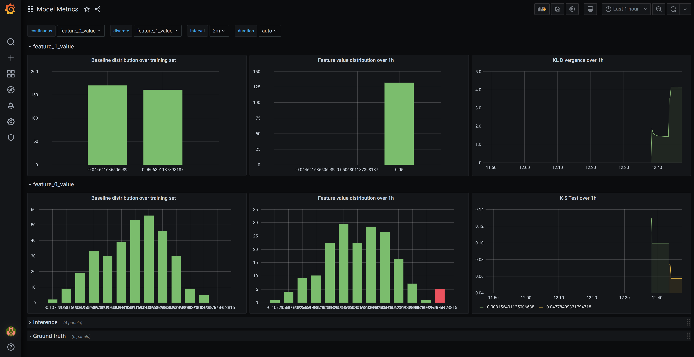

# Grafana & Prometheus

This tutorial uses docker-compose locally to demonstrate training a model, recording its training data histogram, then deploying it with a simple Flask server and then observing the model's divergence in Grafana & Prometheus.

## Clone repo

```bash
git clone https://github.com/boxkite-ml/boxkite
```

```bash
cd boxkite/examples/grafana-prometheus
```

## Setup

Initialise a `python3` virtual environment and activate it. Then install the training dependencies.

```bash
pip install -r requirements.txt
pip install -r app/requirements.txt
```

## Train

The training script generates a linear regression model using sklearn's diabetes dataset.

```bash
python3 train_completed.py
```

Running the command above creates two files in the current directory: `histogram.prom` and `model.pkl`.

## Serve

The serving script creates a flask server that uses the trained model.

```bash
python3 app/serve_completed.py
```

You can test the server by sending a HTTP request using `curl`.

```bash
curl localhost:5000 -H "Content-Type: application/json" \
-d "[0.03, 0.05, -0.002, -0.01, 0.04, 0.01, 0.08, -0.04, 0.005, -0.1]"
```

# PromQL Metrics

!!! tip
    Make sure you have [generated](#train) `histogram.prom` and `model.pkl` in your current directory before continuing.

Start the serving container with Prometheus using `docker-compose`. It automatically scrapes the flask server every 15 seconds for feature distribution metrics.

```bash
docker-compose up
```

Install `requests` library and call `metrics/load.py` to generate some load.

```bash
pip install requests
python3 metrics/load.py
```

Navigate to [http://localhost:3000](http://localhost:3000) for the Grafana GUI, then login with `admin` and `admin`, skip changing the admin password, then navigate to Dashboards -> Manage -> Model Metrics:


