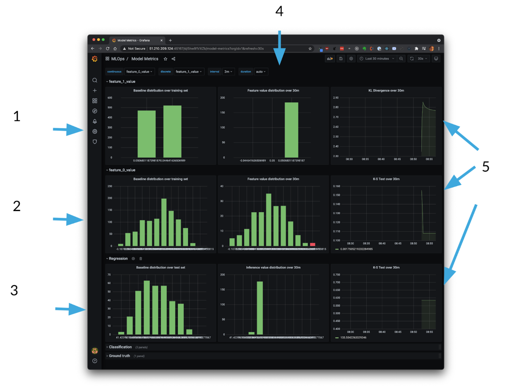

# User Guide

Boxkite is an easy, fully open source way to track model and data drift for Machine Learning models.

**Data drift:** how did the input data vary from when I trained my model to what it's getting in production?

**Model drift:** how are the predictions/classifications that my model is making vary from when it was trained to what it's predicting in production?


You use boxkite by doing three things:

## 1. When you train the model

Just `import boxkite` and then add a call to the `ModelMonitoringService.export_text` method. This tells boxkite to export a text file containing the histogram of your model’s statistical distributions of features (the data the model was trained on) and inferences (results of running your model against the training data).

```python
bunch = load_diabetes()
X_train, X_test, Y_train, Y_test = train_test_split(
    bunch.data, bunch.target
)
model = LinearRegression()
model.fit(X_train, Y_train)

print("Score: %.2f" % model.score(X_test, Y_test))
with open("./model.pkl", "wb") as f:
    pickle.dump(model, f)

# features = [("age", [33, 23, 54, ...]), ("sex", [0, 1, 0]), ...]
features = zip(*[bunch.feature_names, X_train.T])

Y_pred = model.predict(X_test)
inference = list(Y_pred)

ModelMonitoringService.export_text(
    features=features, inference=inference, path="./histogram.txt", # <-- HERE
)
mlflow.log_artifact("./histogram.txt")
```

This way, boxkite takes a snapshot of the shape of the input and output of the model at training time, as well as the model itself. In this example, we’re logging the histogram to mlflow along with the model file itself, so that they can be tracked and versioned there together.

## 2. When you run the model

In your model serving code (assuming your model is running in, say, a flask server), we initialize the `ModelMonitoringService` class with the `histogram_file` we collected at training time:

```python
monitor = ModelMonitoringService(
    baseline_collector=BaselineMetricCollector(path=histogram_file)
)
```

Then when we’re doing inference, we call the `monitor.log_prediction` method and boxkite will automatically compare our production time distributions to the training time distributions:


```python
@app.route("/", methods=["POST"])
def predict():
    features = request.json
    score = model.predict([features])[0]
    pid = monitor.log_prediction( # <-- HERE
        request_body=request.data,
        features=features,
        output=score,
    )
    return {"result": score, "prediction_id": pid}

```

## 3. Expose the metrics

Then we expose a Prometheus format `/metrics` endpoint which just calls into the `ModelMonitoringService`'s `export_http` method:

```python
@app.route("/metrics", methods=["GET"])
def metrics():
    return monitor.export_http()[0]

```

Then configure your Prometheus instance to scrape your model server. How you do this depends on your setup, you might need to add `prometheus.io/scrape: "true"` to your pod annotations, or Prometheus might be set up to scrape your model server already.

Simply expose metrics and then use our [Grafana dashboard](https://github.com/boxkite-ml/boxkite/blob/master/examples/grafana-prometheus/metrics/dashboards/model.json).



The dashboard gives you:

1. Baseline distribution over training set for a categorical feature
2. Baseline distribution over training set for a continuous variable
3. Baseline distribution of predictions for this, a continuous (regression) model
4. How the same values vary at runtime (in production, across multiple HA model servers)
5. The KL divergence and K-S Tests for how the variance of these distributions is varying over time!

## Try a tutorial!

See our tutorials for full worked examples with sample code:

- [Prometheus & Grafana](tutorials/grafana-prometheus.md) in Docker Compose
- [Kubeflow & MLflow](tutorials/kubeflow-mlflow.md) on Kubernetes
