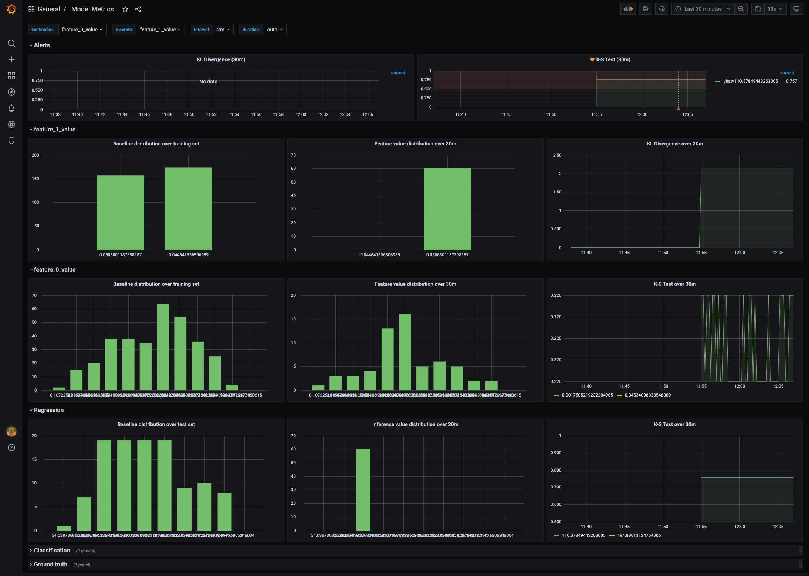
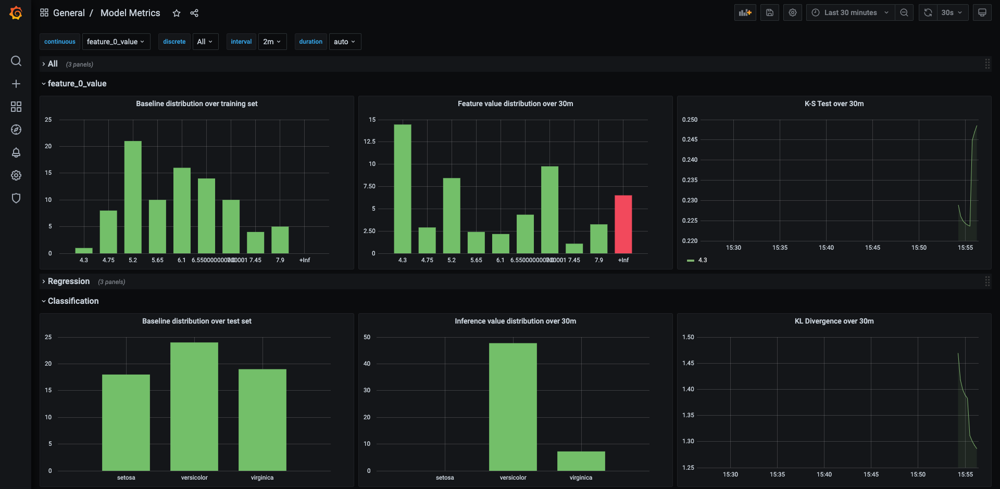

# Boxkite + Prometheus + Grafana locally

This tutorial uses docker-compose locally to demonstrate training a model, recording its training data histogram, then deploying it with a simple Flask server and then observing the model's divergence in Grafana & Prometheus.

## Setup

Initialise a `python3` virtual environment and activate it. Then install the training dependencies.

```bash
pip install -r requirements.txt
pip install -r app/requirements.txt
```

## Train

The training script generates a linear regression model using sklearn's diabetes dataset.

```bash
python train_completed.py
```

Running the command above creates two files in the current directory: `histogram.prom` and `model.pkl`.

## Serve

The serving script creates a flask server that uses the trained model.

```bash
python app/serve_completed.py
```

You can test the server by sending a HTTP request using `curl`.

```bash
curl localhost:5000 -H "Content-Type: application/json" \
-d "[0.03, 0.05, -0.002, -0.01, 0.04, 0.01, 0.08, -0.04, 0.005, -0.1]"
```

# PromQL Metrics

Start the monitoring stack locally using `docker-compose.yml`.

```bash
docker compose up
```

Generate some load with `metrics/load.py`.

```bash
pip install requests
python metrics/load.py
```

Prometheus is configured to automatically scrape the flask server every 15 seconds for feature distribution metrics. Navigate to [http://localhost:3000](http://localhost:3000) for the Grafana GUI, then login with `admin` and `admin`, skip changing the admin password, then navigate to Dashboards -> Manage -> Model Metrics:



## Alerts

Default alerting rules on inference metrics are evaluated every minute. If their values exceed the predefined threshold for 5 minutes straight, a notification will be sent out to the default notification channel (eg. email, slack, etc.). Please refer to [Grafana Tutorial](https://grafana.com/docs/grafana/latest/alerting/notifications/#add-a-notification-channel) for setting up your preferred channel.

## Classification

Similarly, you may train a multiclass logistic regression model and easily compare the classification results between training and production. The same serving code would work for this example.

```bash
docker-compose down
python train_classification.py
docker-compose up
python metrics/load.py -c
```

Passing the `-c` flag generates payload for sklearn's iris dataset.


